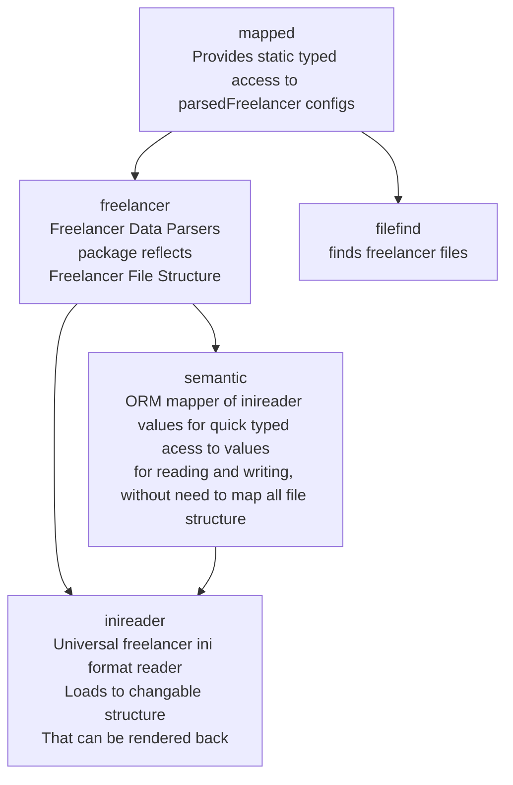

# fldarkdata

## Description

Reusable library parser of Freelancer Discovery game data.

freelancer (resembling ini) config reader/writer with easily mapping variables to access in ORM - object relational mapping fashion.
This alone allows quickly accessing any config data with least amont of code effort for additional features.

# Features

- it offers custom ORM like static typed access to data.
- With ability to read and write data back without requiring to write code for writing
  - U can be just changing ORM mapped values

This library is used at least in projects:

- fldarklint (config formatter)
- fldarkstat (online flstat)

## Architecture

