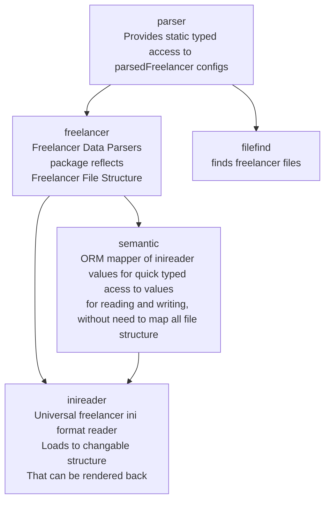

 
# fldarkdata

## Description

Reusable library parser of Freelancer Discovery game data.
- As interesting features, it offers custom ORM like static typed access to data.
- With ability to read and write data back without requiring to write code for writing
    - because it reads and writes game data configs in a universal way

This library is used at least in projects:
- fldarklint (config formatter)
- fldarkstat (online flstat)

## How to use

TODO to add.

## Architecture

